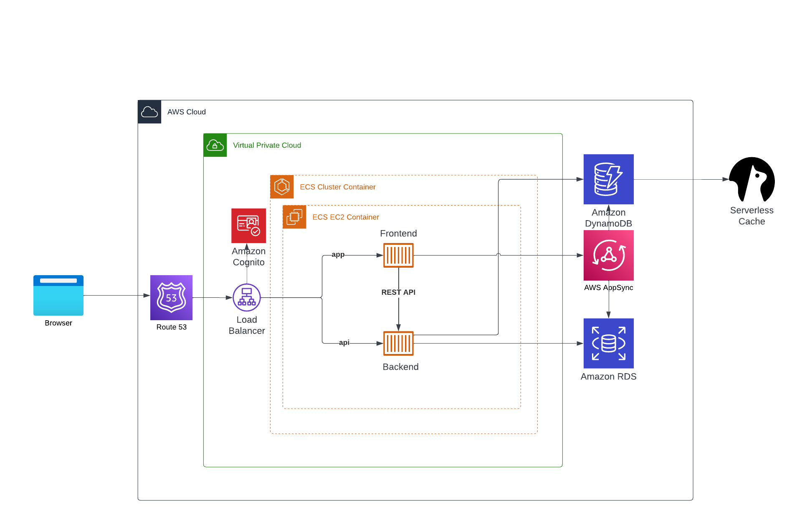

# Week 0 — Billing and Architecture

Here I have documented the tasks i have done in week 0 of the course.

- [Week 0 — Billing and Architecture](#week-0--billing-and-architecture)
  - [Tasks](#tasks)
    - [Account related](#account-related)
    - [Budgets](#budgets)
    - [Security](#security)
    - [Architechture diagram](#architechture-diagram)
    - [Service limits](#service-limits)
  - [Notes](#notes)
    - [Configure AWS CLI](#configure-aws-cli)
    - [Persist AWS CLI configuration variables in gitpod using following instructions](#persist-aws-cli-configuration-variables-in-gitpod-using-following-instructions)


## Tasks

### Account related

- [x] Created an AWS account
- [x] Created non-root IAM user for account operation
- [x] CLI setup and configuration
- [x] Created new AWS organization with the IAM user account
- [x] Added new Business unit to the organization with a another AWS account

### Budgets

- [x] Budget alerts setup
- [x] Added promo code

### Security

- [x] MFA setup for both root and IAM user account
- [x] Tried SCP(secure control policies) and IAM policies
- [x] Tried IAM roles for swtiching between accounts
- [x] Enabled cloud trail for management events

### Architechture diagram

- [x] Went through AWS Well-Architected Framework
- [x] Created a diagram for the architecture as shown below




[Link](https://lucid.app/documents/view/6378ecba-2ceb-42df-bd2d-9aa402984714) to diagram in Lucid chart


### Service limits

- In AWS, service limits refer to the maximum amount of resources that you can use within a particular AWS service. 
- These limits can be seen in the AWS console under the service limits section.
- Lifting service limit may have impact on the billing in case of mistakes. So, I have not lifted any service limit.


## Notes
### Configure AWS CLI

Run following commands on CLI to install AWS CLI

```
curl "https://awscli.amazonaws.com/awscli-exe-linux-x86_64.zip" -o "awscliv2.zip"
unzip awscliv2.zip
sudo ./aws/install
aws --version
```

### Persist AWS CLI configuration variables in gitpod using following instructions

```
gp env AWS_ACCESS_KEY_ID=<Value>
gp env AWS_SECRET_ACCESS_KEY=<Value>
gp env AWS_DEFAULT_REGION=<value>

```